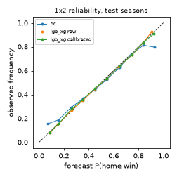
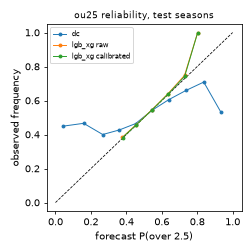

# football-edge v2: main model (Phase 4, cards 4.1-4.4)

Generated by `uv run python scripts/run_main.py --stage report` from `data/interim/` caches. Companion CSVs in this directory: `v2_main_metrics.csv`, `v2_main_pool_weights.csv`, `v2_main_pool_weights_by_season.csv`, `v2_main_fold_info.csv`. The evaluation join (leagues, test seasons from 2016/17, reference-book rule, power de-vig, pooled log opinion pool, 95% match-clustered bootstrap) is exactly the one in `reports/v1_baseline.md`, restricted to rows where every model below has a prediction.

## 1. What was run

- Evaluation rows: 66373 (1X2), 46417 (over/under 2.5); 18 divisions, seasons 2016/17 to 2026/27 (2026/27 partial).
- **Features** (all as-of, `fedge.features.*`; leakage tests in `tests/test_form.py`, `tests/test_ratings.py`): Elo difference and pi-rating expected goal difference (fixed a-priori parameters), online Poisson attack/defence ratings ("DC-lite"), exponentially time-weighted (half-life 120 days, shrunk to the division mean with 3 pseudo-matches) goals for/against, points, home-only/away-only goals, rest days, games played this season, new-to-division (promoted) flag and the division code. The `xg` variant adds time-weighted shots, shots on target and xG for/against (NaN where absent: LightGBM/CatBoost handle it natively). `goals` = no shots or xG.
- xG exists for D1, E0, F1, I1, SP1 (Understat) and for football-data's 2026/27 `HxG/AxG`; all other rows have NaN xG features.
- **Models**: LightGBM (`lgb_*`) and CatBoost (`cb_*`) multiclass for 1X2 and binary for over 2.5, one model across all 18 divisions, goals-only and xG variants. `lgbd_xg` is the decorrelated variant (section 7). `lgb_xg` was named the headline model before any result was seen.
- **Walk-forward** per test season S: model A on seasons before S-1 (early stopping on the first half of S-1), calibrator chosen in-fold on the second half of S-1 (identity / isotonic / Beta / Venn-Abers, lowest held-out log-loss), final model refit on every match before S with 1.1x the early-stopped tree count, 3h embargo on every cut. Seeds fixed (`seed=0`), deterministic LightGBM, fixed thread counts.
- **Pool**: same log opinion pool as v1 with the model weight `w` against the pre-closing and closing de-margined reference price; bootstrap resamples per cell = 100 (v1: 200).

## 2. Pooled scores (all divisions, test seasons)

RPS/Brier are multiclass sums; `cal_slope` is the pooled one-vs-rest logistic recalibration slope (1.0 = calibrated). Lower is better except slope.

### 1X2

| model | n | rps | log_loss | brier | cal_slope |
|---|---|---|---|---|---|
| dc | 66373 | 0.2109 | 1.0273 | 0.6148 | 0.8778 |
| elo | 66373 | 0.2083 | 1.0164 | 0.6089 | 0.9049 |
| pi | 66373 | 0.2087 | 1.0177 | 0.6099 | 0.9356 |
| market_pre | 66373 | 0.2025 | 0.9987 | 0.5965 | 1.0103 |
| market_close | 66373 | 0.2012 | 0.9941 | 0.5936 | 1.0298 |
| lgb_goals | 66373 | 0.2074 | 1.0136 | 0.6071 | 0.9768 |
| lgb_goals (uncalibrated) | 66373 | 0.2075 | 1.0137 | 0.6072 | 0.9740 |
| lgb_xg | 66373 | 0.2063 | 1.0103 | 0.6048 | 0.9586 |
| lgb_xg (uncalibrated) | 66373 | 0.2061 | 1.0097 | 0.6044 | 0.9614 |
| cb_goals | 66373 | 0.2076 | 1.0142 | 0.6075 | 0.9701 |
| cb_goals (uncalibrated) | 66373 | 0.2076 | 1.0139 | 0.6074 | 0.9771 |
| cb_xg | 66373 | 0.2063 | 1.0106 | 0.6050 | 0.9611 |
| cb_xg (uncalibrated) | 66373 | 0.2061 | 1.0096 | 0.6044 | 0.9594 |
| lgbd_xg | 66373 | 0.2025 | 0.9988 | 0.5966 | 0.9940 |
| lgbd_xg (uncalibrated) | 66373 | 0.2025 | 0.9985 | 0.5965 | 1.0099 |

### Over/under 2.5

| model | n | rps | log_loss | brier | cal_slope |
|---|---|---|---|---|---|
| dc | 46417 | 0.2483 | 0.6921 | 0.4965 | 0.5040 |
| market_pre | 46417 | 0.2420 | 0.6775 | 0.4839 | 0.9165 |
| market_close | 46417 | 0.2401 | 0.6730 | 0.4803 | 1.0193 |
| lgb_goals | 46417 | 0.2443 | 0.6815 | 0.4885 | 0.9996 |
| lgb_goals (uncalibrated) | 46417 | 0.2442 | 0.6814 | 0.4884 | 1.0200 |
| lgb_xg | 46417 | 0.2437 | 0.6803 | 0.4873 | 1.0073 |
| lgb_xg (uncalibrated) | 46417 | 0.2436 | 0.6802 | 0.4872 | 1.0141 |
| cb_goals | 46417 | 0.2443 | 0.6816 | 0.4885 | 0.9859 |
| cb_goals (uncalibrated) | 46417 | 0.2442 | 0.6815 | 0.4885 | 0.9949 |
| cb_xg | 46417 | 0.2438 | 0.6806 | 0.4877 | 1.0062 |
| cb_xg (uncalibrated) | 46417 | 0.2438 | 0.6805 | 0.4875 | 1.0379 |
| lgbd_xg | 46417 | 0.2420 | 0.6774 | 0.4839 | 0.9065 |
| lgbd_xg (uncalibrated) | 46417 | 0.2420 | 0.6775 | 0.4839 | 0.9109 |

## 3. Comparison vs Dixon-Coles

Mean per-match log-loss difference to Dixon-Coles (negative = better than DC) with a 1000-resample match bootstrap 95% CI:

### 1X2

| model | mean_dlogloss_vs_dc | lo | hi |
|---|---|---|---|
| lgb_goals | -0.0137 | -0.0155 | -0.0120 |
| lgb_xg | -0.0170 | -0.0189 | -0.0152 |
| cb_goals | -0.0131 | -0.0150 | -0.0114 |
| cb_xg | -0.0167 | -0.0185 | -0.0148 |
| lgbd_xg | -0.0285 | -0.0305 | -0.0266 |
| market_pre | -0.0286 | -0.0306 | -0.0267 |

### Over/under 2.5

| model | mean_dlogloss_vs_dc | lo | hi |
|---|---|---|---|
| lgb_goals | -0.0106 | -0.0124 | -0.0089 |
| lgb_xg | -0.0118 | -0.0136 | -0.0101 |
| cb_goals | -0.0106 | -0.0123 | -0.0088 |
| cb_xg | -0.0115 | -0.0132 | -0.0097 |
| lgbd_xg | -0.0147 | -0.0167 | -0.0129 |
| market_pre | -0.0146 | -0.0165 | -0.0127 |

Per league (log-loss, all test seasons):

### 1X2

| div | n | dc_ll | market_pre_ll | lgb_goals_ll | lgb_xg_ll | cb_goals_ll | cb_xg_ll | lgbd_xg_ll |
|---|---|---|---|---|---|---|---|---|
| B1 | 2821 | 1.0161 | 0.9965 | 1.0067 | 0.9991 | 1.0050 | 1.0020 | 0.9966 |
| D1 | 3077 | 1.0054 | 0.9783 | 0.9970 | 0.9926 | 0.9972 | 0.9917 | 0.9789 |
| D2 | 3086 | 1.0793 | 1.0508 | 1.0627 | 1.0589 | 1.0638 | 1.0584 | 1.0518 |
| E0 | 3828 | 0.9824 | 0.9534 | 0.9696 | 0.9667 | 0.9716 | 0.9665 | 0.9539 |
| E1 | 5569 | 1.0650 | 1.0342 | 1.0509 | 1.0481 | 1.0518 | 1.0478 | 1.0346 |
| E2 | 5409 | 1.0639 | 1.0270 | 1.0429 | 1.0392 | 1.0433 | 1.0398 | 1.0273 |
| E3 | 5458 | 1.0820 | 1.0529 | 1.0654 | 1.0635 | 1.0659 | 1.0631 | 1.0529 |
| F1 | 3495 | 1.0117 | 0.9826 | 1.0021 | 0.9989 | 1.0015 | 0.9988 | 0.9833 |
| F2 | 3570 | 1.0799 | 1.0467 | 1.0626 | 1.0583 | 1.0620 | 1.0574 | 1.0453 |
| G1 | 2214 | 0.9608 | 0.9430 | 0.9523 | 0.9473 | 0.9520 | 0.9495 | 0.9425 |
| I1 | 3822 | 0.9756 | 0.9469 | 0.9675 | 0.9625 | 0.9677 | 0.9627 | 0.9481 |
| I2 | 3869 | 1.0753 | 1.0465 | 1.0603 | 1.0591 | 1.0642 | 1.0613 | 1.0462 |
| N1 | 3007 | 0.9604 | 0.9377 | 0.9526 | 0.9486 | 0.9525 | 0.9497 | 0.9379 |
| P1 | 3077 | 0.9392 | 0.9235 | 0.9321 | 0.9289 | 0.9329 | 0.9287 | 0.9240 |
| SC0 | 2244 | 0.9654 | 0.9417 | 0.9562 | 0.9539 | 0.9564 | 0.9518 | 0.9431 |
| SP1 | 3834 | 0.9942 | 0.9666 | 0.9832 | 0.9788 | 0.9834 | 0.9804 | 0.9664 |
| SP2 | 4618 | 1.0660 | 1.0378 | 1.0511 | 1.0500 | 1.0522 | 1.0500 | 1.0363 |
| T1 | 3375 | 1.0244 | 0.9814 | 0.9970 | 0.9945 | 0.9969 | 0.9962 | 0.9803 |

### Over/under 2.5

| div | n | dc_ll | market_pre_ll | lgb_goals_ll | lgb_xg_ll | cb_goals_ll | cb_xg_ll | lgbd_xg_ll |
|---|---|---|---|---|---|---|---|---|
| B1 | 2102 | 0.6923 | 0.6823 | 0.6821 | 0.6816 | 0.6817 | 0.6818 | 0.6814 |
| D1 | 2112 | 0.6623 | 0.6467 | 0.6585 | 0.6550 | 0.6584 | 0.6564 | 0.6473 |
| D2 | 2169 | 0.6909 | 0.6738 | 0.6801 | 0.6776 | 0.6791 | 0.6780 | 0.6729 |
| E0 | 2676 | 0.6850 | 0.6752 | 0.6822 | 0.6822 | 0.6837 | 0.6819 | 0.6772 |
| E1 | 3911 | 0.6967 | 0.6839 | 0.6900 | 0.6880 | 0.6900 | 0.6886 | 0.6837 |
| E2 | 3752 | 0.7026 | 0.6866 | 0.6905 | 0.6906 | 0.6917 | 0.6914 | 0.6862 |
| E3 | 3807 | 0.7013 | 0.6856 | 0.6882 | 0.6868 | 0.6881 | 0.6862 | 0.6854 |
| F1 | 2353 | 0.6897 | 0.6766 | 0.6840 | 0.6825 | 0.6839 | 0.6818 | 0.6766 |
| F2 | 2423 | 0.7082 | 0.6776 | 0.6825 | 0.6807 | 0.6821 | 0.6818 | 0.6778 |
| G1 | 1634 | 0.6930 | 0.6845 | 0.6791 | 0.6814 | 0.6785 | 0.6791 | 0.6853 |
| I1 | 2684 | 0.6949 | 0.6805 | 0.6872 | 0.6862 | 0.6842 | 0.6851 | 0.6801 |
| I2 | 2645 | 0.7146 | 0.6883 | 0.6886 | 0.6886 | 0.6900 | 0.6897 | 0.6884 |
| N1 | 2103 | 0.6684 | 0.6613 | 0.6650 | 0.6642 | 0.6648 | 0.6640 | 0.6624 |
| P1 | 2139 | 0.6899 | 0.6771 | 0.6779 | 0.6769 | 0.6781 | 0.6767 | 0.6772 |
| SC0 | 1563 | 0.6845 | 0.6813 | 0.6789 | 0.6792 | 0.6809 | 0.6809 | 0.6802 |
| SP1 | 2691 | 0.6853 | 0.6690 | 0.6800 | 0.6780 | 0.6796 | 0.6793 | 0.6705 |
| SP2 | 3220 | 0.6840 | 0.6715 | 0.6711 | 0.6689 | 0.6703 | 0.6708 | 0.6688 |
| T1 | 2433 | 0.6929 | 0.6798 | 0.6822 | 0.6793 | 0.6839 | 0.6798 | 0.6788 |

Per test season (headline model vs DC vs pre-closing market):

### 1X2

| season | n | dc_ll | dc_slope | lgb_xg_ll | lgb_xg_slope | market_pre_ll | market_pre_slope |
|---|---|---|---|---|---|---|---|
| 2016/17 | 6612 | 1.0178 | 0.9719 | 1.0045 | 1.0282 | 0.9885 | 1.0872 |
| 2017/18 | 6594 | 1.0265 | 0.9015 | 1.0101 | 0.9620 | 0.9943 | 1.0204 |
| 2018/19 | 6503 | 1.0197 | 0.9104 | 1.0071 | 0.9806 | 0.9951 | 1.0135 |
| 2019/20 | 5973 | 1.0343 | 0.8230 | 1.0168 | 0.9055 | 1.0076 | 0.9531 |
| 2020/21 | 6758 | 1.0430 | 0.7696 | 1.0271 | 0.9226 | 1.0112 | 0.9936 |
| 2021/22 | 6770 | 1.0300 | 0.8617 | 1.0125 | 1.0792 | 0.9976 | 1.0408 |
| 2022/23 | 6697 | 1.0203 | 0.9254 | 1.0001 | 0.9961 | 0.9929 | 1.0692 |
| 2023/24 | 6702 | 1.0223 | 0.9057 | 1.0041 | 0.8776 | 0.9880 | 1.0432 |
| 2024/25 | 6584 | 1.0243 | 0.8955 | 1.0060 | 0.9371 | 0.9937 | 1.0004 |
| 2025/26 | 6096 | 1.0264 | 0.8987 | 1.0128 | 0.9469 | 1.0162 | 0.9038 |
| 2026/27 | 1084 | 1.0819 | 0.5389 | 1.0252 | 0.9086 | 1.0232 | 0.8531 |

### Over/under 2.5

| season | n | dc_ll | dc_slope | lgb_xg_ll | lgb_xg_slope | market_pre_ll | market_pre_slope |
|---|---|---|---|---|---|---|---|
| 2019/20 | 5968 | 0.6909 | 0.5273 | 0.6790 | 1.1365 | 0.6747 | 0.9775 |
| 2020/21 | 6751 | 0.6926 | 0.4953 | 0.6783 | 1.0369 | 0.6731 | 1.0620 |
| 2021/22 | 6765 | 0.6914 | 0.5179 | 0.6828 | 0.9011 | 0.6788 | 1.0075 |
| 2022/23 | 6678 | 0.6900 | 0.5399 | 0.6773 | 1.2829 | 0.6738 | 1.1417 |
| 2023/24 | 6680 | 0.6920 | 0.5040 | 0.6788 | 1.1327 | 0.6728 | 1.0846 |
| 2024/25 | 6564 | 0.6926 | 0.5009 | 0.6837 | 0.7762 | 0.6763 | 0.9727 |
| 2025/26 | 5946 | 0.6957 | 0.4339 | 0.6842 | 0.8829 | 0.6935 | 0.4678 |
| 2026/27 | 1065 | 0.6919 | 0.4807 | 0.6700 | 1.2277 | 0.6859 | 0.5658 |

## 3b. Per league x season (headline vs DC vs pre-closing market)

All models: `v2_main_metrics_by_league_season.csv`.

### 1x2

| div | season | n | dc_log_loss | lgb_xg_log_loss | market_pre_log_loss | dc_rps | lgb_xg_rps | market_pre_rps |
|---|---|---|---|---|---|---|---|---|
| B1 | 2016/17 | 231 | 1.0082 | 0.9774 | 0.9691 | 0.2051 | 0.1988 | 0.1965 |
| B1 | 2017/18 | 238 | 1.0522 | 1.0414 | 1.0314 | 0.2136 | 0.2145 | 0.2113 |
| B1 | 2018/19 | 239 | 1.0309 | 1.0113 | 0.9890 | 0.2157 | 0.2086 | 0.2013 |
| B1 | 2019/20 | 232 | 0.9552 | 0.9363 | 0.9269 | 0.1982 | 0.1937 | 0.1894 |
| B1 | 2020/21 | 305 | 1.0560 | 1.0609 | 1.0478 | 0.2300 | 0.2311 | 0.2265 |
| B1 | 2021/22 | 305 | 1.0077 | 0.9827 | 0.9680 | 0.2109 | 0.2047 | 0.2012 |
| B1 | 2022/23 | 304 | 0.9841 | 0.9757 | 0.9599 | 0.2059 | 0.2044 | 0.1999 |
| B1 | 2023/24 | 312 | 1.0169 | 0.9832 | 0.9819 | 0.2041 | 0.1971 | 0.1965 |
| B1 | 2024/25 | 311 | 1.0175 | 1.0026 | 0.9958 | 0.1986 | 0.1955 | 0.1946 |
| B1 | 2025/26 | 283 | 1.0415 | 1.0397 | 1.1107 | 0.2168 | 0.2151 | 0.2218 |
| B1 | 2026/27 | 61 | 0.9502 | 0.8732 | 0.8742 | 0.2016 | 0.1793 | 0.1829 |
| D1 | 2016/17 | 306 | 1.0044 | 1.0088 | 0.9972 | 0.2088 | 0.2091 | 0.2059 |
| D1 | 2017/18 | 306 | 1.0224 | 1.0124 | 0.9951 | 0.2075 | 0.2056 | 0.1999 |
| D1 | 2018/19 | 305 | 0.9850 | 0.9753 | 0.9673 | 0.2007 | 0.1994 | 0.1955 |
| D1 | 2019/20 | 306 | 1.0019 | 0.9992 | 0.9718 | 0.2104 | 0.2110 | 0.2028 |
| D1 | 2020/21 | 306 | 1.0300 | 0.9930 | 0.9883 | 0.2118 | 0.2002 | 0.1980 |
| D1 | 2021/22 | 306 | 1.0051 | 1.0027 | 0.9903 | 0.2103 | 0.2091 | 0.2053 |
| D1 | 2022/23 | 306 | 1.0039 | 0.9937 | 0.9966 | 0.2078 | 0.2044 | 0.2044 |
| D1 | 2023/24 | 306 | 0.9918 | 0.9739 | 0.9454 | 0.1996 | 0.1942 | 0.1843 |
| D1 | 2024/25 | 306 | 1.0271 | 1.0152 | 0.9910 | 0.2124 | 0.2093 | 0.2024 |
| D1 | 2025/26 | 288 | 0.9736 | 0.9522 | 0.9401 | 0.1966 | 0.1926 | 0.1887 |
| D1 | 2026/27 | 36 | 1.0629 | 0.9733 | 0.9579 | 0.2146 | 0.2080 | 0.2078 |
| D2 | 2016/17 | 305 | 1.0821 | 1.0573 | 1.0373 | 0.2233 | 0.2169 | 0.2101 |
| D2 | 2017/18 | 306 | 1.1032 | 1.0981 | 1.0840 | 0.2310 | 0.2290 | 0.2247 |
| D2 | 2018/19 | 306 | 1.0925 | 1.0799 | 1.0790 | 0.2250 | 0.2239 | 0.2238 |
| D2 | 2019/20 | 305 | 1.1046 | 1.0754 | 1.0837 | 0.2243 | 0.2162 | 0.2185 |
| D2 | 2020/21 | 302 | 1.0625 | 1.0547 | 1.0375 | 0.2290 | 0.2259 | 0.2214 |
| D2 | 2021/22 | 305 | 1.0954 | 1.0580 | 1.0465 | 0.2281 | 0.2175 | 0.2139 |
| D2 | 2022/23 | 306 | 1.0461 | 1.0277 | 1.0220 | 0.2231 | 0.2170 | 0.2153 |
| D2 | 2023/24 | 306 | 1.0559 | 1.0219 | 1.0225 | 0.2259 | 0.2164 | 0.2180 |
| D2 | 2024/25 | 306 | 1.0785 | 1.0722 | 1.0590 | 0.2258 | 0.2233 | 0.2181 |
| D2 | 2025/26 | 285 | 1.0506 | 1.0370 | 1.0299 | 0.2258 | 0.2204 | 0.2177 |
| D2 | 2026/27 | 54 | 1.1915 | 1.0910 | 1.0783 | 0.2436 | 0.2281 | 0.2245 |
| E0 | 2016/17 | 380 | 0.9373 | 0.9335 | 0.9053 | 0.1903 | 0.1894 | 0.1805 |
| E0 | 2017/18 | 380 | 0.9823 | 0.9544 | 0.9450 | 0.1960 | 0.1884 | 0.1860 |
| E0 | 2018/19 | 380 | 0.8998 | 0.8933 | 0.8906 | 0.1881 | 0.1861 | 0.1852 |
| E0 | 2019/20 | 380 | 0.9750 | 0.9635 | 0.9733 | 0.2003 | 0.1963 | 0.1988 |
| E0 | 2020/21 | 380 | 1.0317 | 1.0238 | 1.0075 | 0.2217 | 0.2183 | 0.2139 |
| E0 | 2021/22 | 380 | 0.9496 | 0.9547 | 0.9356 | 0.1942 | 0.1949 | 0.1887 |
| E0 | 2022/23 | 380 | 1.0309 | 0.9783 | 0.9662 | 0.2183 | 0.2025 | 0.1992 |
| E0 | 2023/24 | 380 | 0.9354 | 0.9309 | 0.9068 | 0.1928 | 0.1906 | 0.1832 |
| E0 | 2024/25 | 380 | 1.0242 | 0.9915 | 0.9709 | 0.2160 | 0.2031 | 0.1975 |
| E0 | 2025/26 | 358 | 1.0456 | 1.0390 | 1.0234 | 0.2129 | 0.2109 | 0.2072 |
| E0 | 2026/27 | 50 | 1.1005 | 1.0272 | 1.0544 | 0.2092 | 0.2011 | 0.2067 |
| E1 | 2016/17 | 552 | 1.0554 | 1.0324 | 1.0100 | 0.2257 | 0.2189 | 0.2116 |
| E1 | 2017/18 | 552 | 1.0780 | 1.0490 | 1.0301 | 0.2261 | 0.2171 | 0.2113 |
| E1 | 2018/19 | 551 | 1.0534 | 1.0419 | 1.0244 | 0.2132 | 0.2104 | 0.2047 |
| E1 | 2019/20 | 551 | 1.0733 | 1.0582 | 1.0545 | 0.2265 | 0.2211 | 0.2196 |
| E1 | 2020/21 | 549 | 1.0695 | 1.0536 | 1.0406 | 0.2279 | 0.2216 | 0.2183 |
| E1 | 2021/22 | 552 | 1.0638 | 1.0548 | 1.0343 | 0.2249 | 0.2237 | 0.2165 |
| E1 | 2022/23 | 552 | 1.0660 | 1.0589 | 1.0574 | 0.2236 | 0.2204 | 0.2203 |
| E1 | 2023/24 | 552 | 1.0535 | 1.0383 | 1.0148 | 0.2273 | 0.2218 | 0.2146 |
| E1 | 2024/25 | 552 | 1.0321 | 1.0255 | 1.0283 | 0.2086 | 0.2068 | 0.2080 |
| E1 | 2025/26 | 516 | 1.0875 | 1.0665 | 1.0469 | 0.2307 | 0.2232 | 0.2179 |
| E1 | 2026/27 | 90 | 1.1837 | 1.0690 | 1.0444 | 0.2477 | 0.2181 | 0.2082 |
| E2 | 2016/17 | 552 | 1.0799 | 1.0447 | 1.0318 | 0.2252 | 0.2140 | 0.2100 |
| E2 | 2017/18 | 552 | 1.0677 | 1.0571 | 1.0537 | 0.2237 | 0.2209 | 0.2191 |
| E2 | 2018/19 | 552 | 1.0707 | 1.0480 | 1.0396 | 0.2233 | 0.2182 | 0.2151 |
| E2 | 2019/20 | 390 | 1.0740 | 1.0189 | 1.0070 | 0.2234 | 0.2063 | 0.2023 |
| E2 | 2020/21 | 546 | 1.0797 | 1.0595 | 1.0437 | 0.2338 | 0.2272 | 0.2217 |
| E2 | 2021/22 | 552 | 1.0562 | 1.0195 | 0.9963 | 0.2200 | 0.2090 | 0.2011 |
| E2 | 2022/23 | 552 | 1.0339 | 1.0191 | 1.0043 | 0.2153 | 0.2109 | 0.2061 |
| E2 | 2023/24 | 552 | 1.0463 | 1.0368 | 1.0263 | 0.2179 | 0.2179 | 0.2154 |
| E2 | 2024/25 | 552 | 1.0409 | 1.0303 | 1.0111 | 0.2201 | 0.2174 | 0.2117 |
| E2 | 2025/26 | 519 | 1.0610 | 1.0411 | 1.0383 | 0.2234 | 0.2182 | 0.2145 |
| E2 | 2026/27 | 90 | 1.2562 | 1.1115 | 1.1037 | 0.2451 | 0.2231 | 0.2220 |
| E3 | 2016/17 | 551 | 1.0778 | 1.0635 | 1.0516 | 0.2295 | 0.2252 | 0.2211 |
| E3 | 2017/18 | 551 | 1.0903 | 1.0535 | 1.0375 | 0.2318 | 0.2214 | 0.2163 |
| E3 | 2018/19 | 549 | 1.0628 | 1.0633 | 1.0458 | 0.2233 | 0.2235 | 0.2178 |
| E3 | 2019/20 | 426 | 1.0990 | 1.0720 | 1.0583 | 0.2276 | 0.2196 | 0.2151 |
| E3 | 2020/21 | 552 | 1.1022 | 1.0846 | 1.0694 | 0.2335 | 0.2282 | 0.2240 |
| E3 | 2021/22 | 552 | 1.0565 | 1.0515 | 1.0448 | 0.2184 | 0.2173 | 0.2150 |
| E3 | 2022/23 | 551 | 1.0838 | 1.0694 | 1.0543 | 0.2233 | 0.2200 | 0.2151 |
| E3 | 2023/24 | 552 | 1.0856 | 1.0624 | 1.0495 | 0.2361 | 0.2289 | 0.2254 |
| E3 | 2024/25 | 550 | 1.0972 | 1.0692 | 1.0599 | 0.2302 | 0.2203 | 0.2177 |
| E3 | 2025/26 | 525 | 1.0632 | 1.0426 | 1.0550 | 0.2263 | 0.2197 | 0.2186 |
| E3 | 2026/27 | 99 | 1.1072 | 1.0865 | 1.0762 | 0.2202 | 0.2148 | 0.2083 |
| F1 | 2016/17 | 378 | 0.9940 | 0.9721 | 0.9636 | 0.2013 | 0.1970 | 0.1946 |
| F1 | 2017/18 | 377 | 0.9890 | 0.9686 | 0.9507 | 0.1976 | 0.1949 | 0.1903 |
| F1 | 2018/19 | 379 | 1.0459 | 1.0328 | 1.0023 | 0.2130 | 0.2094 | 0.2004 |
| F1 | 2019/20 | 279 | 1.0118 | 1.0039 | 0.9912 | 0.2091 | 0.2054 | 0.2025 |
| F1 | 2020/21 | 378 | 1.0384 | 1.0228 | 0.9990 | 0.2185 | 0.2133 | 0.2054 |
| F1 | 2021/22 | 380 | 1.0171 | 1.0177 | 1.0001 | 0.2070 | 0.2068 | 0.2022 |
| F1 | 2022/23 | 380 | 0.9965 | 0.9747 | 0.9696 | 0.2061 | 0.1994 | 0.1980 |
| F1 | 2023/24 | 306 | 1.0399 | 1.0337 | 1.0151 | 0.2137 | 0.2131 | 0.2065 |
| F1 | 2024/25 | 306 | 0.9787 | 0.9688 | 0.9573 | 0.2091 | 0.2054 | 0.2024 |
| F1 | 2025/26 | 287 | 0.9976 | 0.9844 | 0.9713 | 0.2086 | 0.2041 | 0.2008 |
| F1 | 2026/27 | 45 | 1.0457 | 1.0672 | 1.0339 | 0.2097 | 0.2177 | 0.2082 |
| F2 | 2016/17 | 376 | 1.0837 | 1.0835 | 1.0557 | 0.2204 | 0.2222 | 0.2132 |
| F2 | 2017/18 | 379 | 1.0603 | 1.0323 | 1.0216 | 0.2289 | 0.2198 | 0.2160 |
| F2 | 2018/19 | 377 | 1.0701 | 1.0599 | 1.0621 | 0.2187 | 0.2178 | 0.2182 |
| F2 | 2019/20 | 277 | 1.0863 | 1.0780 | 1.0657 | 0.2210 | 0.2218 | 0.2169 |
| F2 | 2020/21 | 379 | 1.0721 | 1.0494 | 1.0313 | 0.2108 | 0.2056 | 0.2002 |
| F2 | 2021/22 | 380 | 1.0580 | 1.0454 | 1.0287 | 0.2190 | 0.2144 | 0.2091 |
| F2 | 2022/23 | 375 | 1.0874 | 1.0473 | 1.0365 | 0.2265 | 0.2165 | 0.2137 |
| F2 | 2023/24 | 379 | 1.0992 | 1.0902 | 1.0719 | 0.2304 | 0.2265 | 0.2210 |
| F2 | 2024/25 | 306 | 1.1030 | 1.0233 | 1.0188 | 0.2321 | 0.2152 | 0.2137 |
| F2 | 2025/26 | 281 | 1.0826 | 1.0702 | 1.0751 | 0.2205 | 0.2181 | 0.2182 |
| F2 | 2026/27 | 61 | 1.1017 | 1.0935 | 1.0911 | 0.2123 | 0.2108 | 0.2113 |
| G1 | 2016/17 | 191 | 0.9871 | 0.9713 | 0.9369 | 0.1949 | 0.1901 | 0.1803 |
| G1 | 2017/18 | 180 | 1.0179 | 0.9876 | 0.9753 | 0.1907 | 0.1822 | 0.1822 |
| G1 | 2018/19 | 208 | 0.9229 | 0.8816 | 0.8664 | 0.1834 | 0.1721 | 0.1686 |
| G1 | 2019/20 | 220 | 0.9173 | 0.8930 | 0.8922 | 0.1750 | 0.1691 | 0.1682 |
| G1 | 2020/21 | 223 | 0.9906 | 0.9697 | 0.9667 | 0.1949 | 0.1904 | 0.1881 |
| G1 | 2021/22 | 240 | 1.0122 | 0.9902 | 0.9912 | 0.2047 | 0.2023 | 0.2027 |
| G1 | 2022/23 | 239 | 0.9452 | 0.9253 | 0.9073 | 0.1818 | 0.1735 | 0.1682 |
| G1 | 2023/24 | 240 | 0.9271 | 0.9252 | 0.8982 | 0.1809 | 0.1826 | 0.1725 |
| G1 | 2024/25 | 233 | 0.9754 | 1.0004 | 0.9824 | 0.2034 | 0.2094 | 0.2050 |
| G1 | 2025/26 | 208 | 0.9314 | 0.9410 | 1.0173 | 0.1782 | 0.1805 | 0.1903 |
| G1 | 2026/27 | 32 | 0.8926 | 0.8831 | 0.9534 | 0.1750 | 0.1718 | 0.1920 |
| I1 | 2016/17 | 377 | 0.9197 | 0.9119 | 0.8982 | 0.1879 | 0.1862 | 0.1816 |
| I1 | 2017/18 | 379 | 0.9267 | 0.9222 | 0.8911 | 0.1879 | 0.1876 | 0.1780 |
| I1 | 2018/19 | 380 | 0.9742 | 0.9709 | 0.9443 | 0.1892 | 0.1877 | 0.1800 |
| I1 | 2019/20 | 380 | 1.0132 | 0.9826 | 0.9627 | 0.2120 | 0.2045 | 0.1980 |
| I1 | 2020/21 | 378 | 0.9730 | 0.9502 | 0.9311 | 0.1943 | 0.1861 | 0.1818 |
| I1 | 2021/22 | 379 | 0.9985 | 0.9760 | 0.9776 | 0.2010 | 0.1962 | 0.1961 |
| I1 | 2022/23 | 380 | 1.0029 | 0.9876 | 0.9791 | 0.2027 | 0.1983 | 0.1965 |
| I1 | 2023/24 | 380 | 0.9928 | 0.9769 | 0.9669 | 0.1938 | 0.1876 | 0.1846 |
| I1 | 2024/25 | 380 | 0.9784 | 0.9662 | 0.9489 | 0.1917 | 0.1884 | 0.1831 |
| I1 | 2025/26 | 359 | 0.9820 | 0.9863 | 0.9745 | 0.2005 | 0.2010 | 0.1971 |
| I1 | 2026/27 | 50 | 0.9380 | 0.9243 | 0.9149 | 0.1997 | 0.1933 | 0.1932 |
| I2 | 2016/17 | 443 | 1.0510 | 1.0521 | 1.0403 | 0.2047 | 0.2050 | 0.2016 |
| I2 | 2017/18 | 455 | 1.0755 | 1.0579 | 1.0454 | 0.2089 | 0.2067 | 0.2023 |
| I2 | 2018/19 | 323 | 1.0580 | 1.0400 | 1.0337 | 0.2084 | 0.2036 | 0.2011 |
| I2 | 2019/20 | 371 | 1.0634 | 1.0578 | 1.0555 | 0.2206 | 0.2191 | 0.2188 |
| I2 | 2020/21 | 372 | 1.0810 | 1.0669 | 1.0473 | 0.2143 | 0.2094 | 0.2034 |
| I2 | 2021/22 | 380 | 1.0785 | 1.0481 | 1.0359 | 0.2192 | 0.2094 | 0.2064 |
| I2 | 2022/23 | 377 | 1.1031 | 1.0742 | 1.0665 | 0.2238 | 0.2160 | 0.2133 |
| I2 | 2023/24 | 379 | 1.1096 | 1.0897 | 1.0549 | 0.2242 | 0.2201 | 0.2099 |
| I2 | 2024/25 | 380 | 1.0783 | 1.0697 | 1.0519 | 0.2134 | 0.2121 | 0.2050 |
| I2 | 2025/26 | 342 | 1.0461 | 1.0219 | 1.0247 | 0.2061 | 0.1999 | 0.1989 |
| I2 | 2026/27 | 47 | 1.1316 | 1.1248 | 1.0981 | 0.2453 | 0.2394 | 0.2320 |
| N1 | 2016/17 | 303 | 0.9550 | 0.9470 | 0.9430 | 0.1922 | 0.1905 | 0.1885 |
| N1 | 2017/18 | 290 | 0.9788 | 0.9686 | 0.9671 | 0.2004 | 0.1959 | 0.1958 |
| N1 | 2018/19 | 302 | 0.9202 | 0.9310 | 0.9125 | 0.1925 | 0.1958 | 0.1908 |
| N1 | 2019/20 | 232 | 0.9471 | 0.9565 | 0.9215 | 0.1975 | 0.1995 | 0.1898 |
| N1 | 2020/21 | 306 | 0.9487 | 0.9562 | 0.9299 | 0.1889 | 0.1881 | 0.1819 |
| N1 | 2021/22 | 306 | 0.9700 | 0.9566 | 0.9356 | 0.2062 | 0.2023 | 0.1952 |
| N1 | 2022/23 | 306 | 0.9595 | 0.9228 | 0.9280 | 0.1949 | 0.1825 | 0.1848 |
| N1 | 2023/24 | 306 | 0.9566 | 0.9092 | 0.9028 | 0.1902 | 0.1771 | 0.1750 |
| N1 | 2024/25 | 306 | 0.9655 | 0.9660 | 0.9475 | 0.1924 | 0.1929 | 0.1882 |
| N1 | 2025/26 | 287 | 0.9962 | 0.9776 | 0.9762 | 0.2009 | 0.1958 | 0.1959 |
| N1 | 2026/27 | 63 | 0.9908 | 0.9455 | 1.0003 | 0.1895 | 0.1853 | 0.1978 |
| P1 | 2016/17 | 305 | 0.9839 | 0.9700 | 0.9479 | 0.1987 | 0.1935 | 0.1867 |
| P1 | 2017/18 | 299 | 0.8886 | 0.8954 | 0.8724 | 0.1813 | 0.1846 | 0.1765 |
| P1 | 2018/19 | 298 | 0.9060 | 0.9059 | 0.9022 | 0.1875 | 0.1865 | 0.1855 |
| P1 | 2019/20 | 305 | 0.9951 | 0.9941 | 0.9783 | 0.2021 | 0.2022 | 0.1977 |
| P1 | 2020/21 | 305 | 0.9519 | 0.9557 | 0.9474 | 0.1894 | 0.1901 | 0.1879 |
| P1 | 2021/22 | 306 | 0.9503 | 0.9298 | 0.9209 | 0.1811 | 0.1779 | 0.1751 |
| P1 | 2022/23 | 306 | 0.9050 | 0.8677 | 0.8681 | 0.1880 | 0.1810 | 0.1797 |
| P1 | 2023/24 | 305 | 0.9383 | 0.9138 | 0.9058 | 0.1839 | 0.1799 | 0.1775 |
| P1 | 2024/25 | 306 | 0.9456 | 0.9355 | 0.9309 | 0.1867 | 0.1853 | 0.1837 |
| P1 | 2025/26 | 282 | 0.9051 | 0.9083 | 0.9483 | 0.1704 | 0.1727 | 0.1808 |
| P1 | 2026/27 | 60 | 1.0295 | 0.9826 | 0.9893 | 0.2001 | 0.1901 | 0.1923 |
| SC0 | 2016/17 | 226 | 0.9629 | 0.9512 | 0.9318 | 0.1917 | 0.1893 | 0.1833 |
| SC0 | 2017/18 | 224 | 1.0284 | 1.0059 | 0.9801 | 0.2135 | 0.2050 | 0.1973 |
| SC0 | 2018/19 | 227 | 0.9768 | 0.9311 | 0.9305 | 0.2084 | 0.1929 | 0.1927 |
| SC0 | 2019/20 | 179 | 0.9441 | 0.9321 | 0.9221 | 0.1887 | 0.1831 | 0.1808 |
| SC0 | 2020/21 | 218 | 0.9769 | 0.9676 | 0.9303 | 0.1984 | 0.1925 | 0.1854 |
| SC0 | 2021/22 | 228 | 0.9651 | 0.9749 | 0.9478 | 0.1905 | 0.1908 | 0.1846 |
| SC0 | 2022/23 | 228 | 0.8845 | 0.8675 | 0.8735 | 0.1842 | 0.1813 | 0.1811 |
| SC0 | 2023/24 | 228 | 0.9595 | 0.9627 | 0.9307 | 0.1893 | 0.1858 | 0.1794 |
| SC0 | 2024/25 | 228 | 0.9625 | 0.9634 | 0.9525 | 0.2026 | 0.2035 | 0.1987 |
| SC0 | 2025/26 | 216 | 0.9898 | 0.9737 | 1.0051 | 0.1951 | 0.1907 | 0.1928 |
| SC0 | 2026/27 | 42 | 0.9751 | 0.9874 | 1.0047 | 0.2110 | 0.2120 | 0.2157 |
| SP1 | 2016/17 | 380 | 0.9186 | 0.9258 | 0.9036 | 0.1831 | 0.1847 | 0.1785 |
| SP1 | 2017/18 | 379 | 0.9855 | 0.9734 | 0.9610 | 0.2047 | 0.2004 | 0.1967 |
| SP1 | 2018/19 | 380 | 1.0283 | 1.0168 | 1.0104 | 0.2066 | 0.2024 | 0.2010 |
| SP1 | 2019/20 | 378 | 1.0131 | 0.9968 | 0.9830 | 0.2045 | 0.2004 | 0.1958 |
| SP1 | 2020/21 | 380 | 1.0415 | 0.9931 | 0.9836 | 0.2036 | 0.1947 | 0.1916 |
| SP1 | 2021/22 | 379 | 1.0167 | 1.0034 | 0.9874 | 0.2001 | 0.1966 | 0.1924 |
| SP1 | 2022/23 | 380 | 0.9944 | 0.9842 | 0.9792 | 0.2070 | 0.2044 | 0.2022 |
| SP1 | 2023/24 | 380 | 0.9812 | 0.9603 | 0.9466 | 0.1918 | 0.1855 | 0.1818 |
| SP1 | 2024/25 | 380 | 0.9787 | 0.9587 | 0.9510 | 0.1981 | 0.1916 | 0.1892 |
| SP1 | 2025/26 | 349 | 0.9929 | 0.9845 | 0.9651 | 0.2019 | 0.2014 | 0.1954 |
| SP1 | 2026/27 | 69 | 0.9425 | 0.9332 | 0.9411 | 0.1941 | 0.1881 | 0.1926 |
| SP2 | 2016/17 | 455 | 1.0662 | 1.0495 | 1.0430 | 0.2131 | 0.2083 | 0.2062 |
| SP2 | 2017/18 | 452 | 1.0435 | 1.0336 | 1.0121 | 0.2110 | 0.2092 | 0.2028 |
| SP2 | 2018/19 | 441 | 1.0666 | 1.0388 | 1.0278 | 0.2114 | 0.2035 | 0.2004 |
| SP2 | 2019/20 | 460 | 1.0890 | 1.0894 | 1.0837 | 0.2171 | 0.2166 | 0.2154 |
| SP2 | 2020/21 | 459 | 1.0784 | 1.0623 | 1.0383 | 0.2211 | 0.2177 | 0.2111 |
| SP2 | 2021/22 | 461 | 1.0864 | 1.0496 | 1.0289 | 0.2202 | 0.2128 | 0.2072 |
| SP2 | 2022/23 | 462 | 1.0564 | 1.0431 | 1.0414 | 0.2071 | 0.2025 | 0.2028 |
| SP2 | 2023/24 | 460 | 1.0527 | 1.0588 | 1.0428 | 0.2127 | 0.2147 | 0.2094 |
| SP2 | 2024/25 | 462 | 1.0463 | 1.0239 | 1.0140 | 0.2145 | 0.2069 | 0.2037 |
| SP2 | 2025/26 | 424 | 1.0698 | 1.0520 | 1.0466 | 0.2289 | 0.2224 | 0.2184 |
| SP2 | 2026/27 | 82 | 1.0925 | 1.0437 | 1.0312 | 0.2273 | 0.2201 | 0.2174 |
| T1 | 2016/17 | 301 | 1.0132 | 0.9976 | 0.9865 | 0.2156 | 0.2107 | 0.2075 |
| T1 | 2017/18 | 295 | 0.9690 | 0.9699 | 0.9378 | 0.1997 | 0.2002 | 0.1913 |
| T1 | 2018/19 | 306 | 1.0412 | 1.0385 | 1.0223 | 0.2110 | 0.2088 | 0.2046 |
| T1 | 2019/20 | 302 | 1.0704 | 1.0212 | 1.0202 | 0.2198 | 0.2090 | 0.2088 |
| T1 | 2020/21 | 420 | 1.0452 | 1.0331 | 1.0279 | 0.2133 | 0.2104 | 0.2085 |
| T1 | 2021/22 | 379 | 1.0451 | 1.0119 | 0.9962 | 0.2221 | 0.2108 | 0.2063 |
| T1 | 2022/23 | 313 | 0.9942 | 0.9852 | 0.9709 | 0.2057 | 0.2050 | 0.1992 |
| T1 | 2023/24 | 379 | 1.0128 | 0.9561 | 0.9456 | 0.2019 | 0.1899 | 0.1856 |
| T1 | 2024/25 | 340 | 1.0031 | 0.9349 | 0.9173 | 0.2077 | 0.1885 | 0.1806 |
| T1 | 2025/26 | 287 | 1.0043 | 0.9791 | 0.9714 | 0.1971 | 0.1900 | 0.1800 |
| T1 | 2026/27 | 53 | 1.2322 | 1.0738 | 1.0464 | 0.2782 | 0.2409 | 0.2319 |

### ou25

| div | season | n | dc_log_loss | lgb_xg_log_loss | market_pre_log_loss | dc_rps | lgb_xg_rps | market_pre_rps |
|---|---|---|---|---|---|---|---|---|
| B1 | 2019/20 | 232 | 0.7024 | 0.6836 | 0.6900 | 0.2541 | 0.2452 | 0.2480 |
| B1 | 2020/21 | 305 | 0.6701 | 0.6752 | 0.6663 | 0.2372 | 0.2411 | 0.2368 |
| B1 | 2021/22 | 305 | 0.6944 | 0.6816 | 0.6804 | 0.2501 | 0.2443 | 0.2437 |
| B1 | 2022/23 | 304 | 0.6758 | 0.6744 | 0.6678 | 0.2407 | 0.2407 | 0.2375 |
| B1 | 2023/24 | 312 | 0.6851 | 0.6772 | 0.6836 | 0.2460 | 0.2421 | 0.2454 |
| B1 | 2024/25 | 311 | 0.6974 | 0.6850 | 0.6705 | 0.2483 | 0.2461 | 0.2389 |
| B1 | 2025/26 | 272 | 0.7178 | 0.6958 | 0.7118 | 0.2608 | 0.2512 | 0.2533 |
| B1 | 2026/27 | 61 | 0.7330 | 0.6840 | 0.7361 | 0.2687 | 0.2453 | 0.2594 |
| D1 | 2019/20 | 306 | 0.6635 | 0.6415 | 0.6365 | 0.2356 | 0.2249 | 0.2227 |
| D1 | 2020/21 | 301 | 0.6697 | 0.6588 | 0.6499 | 0.2382 | 0.2334 | 0.2294 |
| D1 | 2021/22 | 301 | 0.6515 | 0.6601 | 0.6533 | 0.2303 | 0.2341 | 0.2311 |
| D1 | 2022/23 | 292 | 0.6661 | 0.6659 | 0.6651 | 0.2366 | 0.2367 | 0.2363 |
| D1 | 2023/24 | 292 | 0.6699 | 0.6596 | 0.6468 | 0.2367 | 0.2332 | 0.2273 |
| D1 | 2024/25 | 296 | 0.6433 | 0.6596 | 0.6465 | 0.2256 | 0.2337 | 0.2274 |
| D1 | 2025/26 | 288 | 0.6652 | 0.6489 | 0.6386 | 0.2368 | 0.2289 | 0.2244 |
| D1 | 2026/27 | 36 | 0.7223 | 0.5792 | 0.5675 | 0.2488 | 0.1949 | 0.1900 |
| D2 | 2019/20 | 305 | 0.6986 | 0.6959 | 0.6925 | 0.2526 | 0.2513 | 0.2497 |
| D2 | 2020/21 | 302 | 0.7193 | 0.6769 | 0.6660 | 0.2628 | 0.2419 | 0.2366 |
| D2 | 2021/22 | 305 | 0.6808 | 0.6729 | 0.6780 | 0.2439 | 0.2400 | 0.2425 |
| D2 | 2022/23 | 306 | 0.6814 | 0.6814 | 0.6743 | 0.2441 | 0.2441 | 0.2406 |
| D2 | 2023/24 | 306 | 0.6742 | 0.6722 | 0.6726 | 0.2404 | 0.2396 | 0.2397 |
| D2 | 2024/25 | 306 | 0.6790 | 0.6624 | 0.6597 | 0.2422 | 0.2349 | 0.2336 |
| D2 | 2025/26 | 285 | 0.7026 | 0.6823 | 0.6777 | 0.2544 | 0.2446 | 0.2421 |
| D2 | 2026/27 | 54 | 0.6987 | 0.6754 | 0.6531 | 0.2466 | 0.2408 | 0.2278 |
| E0 | 2019/20 | 380 | 0.6650 | 0.6722 | 0.6635 | 0.2356 | 0.2397 | 0.2356 |
| E0 | 2020/21 | 380 | 0.7071 | 0.6930 | 0.6918 | 0.2559 | 0.2498 | 0.2490 |
| E0 | 2021/22 | 380 | 0.6725 | 0.6883 | 0.6824 | 0.2398 | 0.2475 | 0.2447 |
| E0 | 2022/23 | 379 | 0.6831 | 0.6757 | 0.6689 | 0.2453 | 0.2415 | 0.2383 |
| E0 | 2023/24 | 372 | 0.6903 | 0.6603 | 0.6488 | 0.2485 | 0.2338 | 0.2284 |
| E0 | 2024/25 | 377 | 0.6860 | 0.6929 | 0.6819 | 0.2463 | 0.2495 | 0.2444 |
| E0 | 2025/26 | 358 | 0.6850 | 0.6911 | 0.6886 | 0.2458 | 0.2490 | 0.2477 |
| E0 | 2026/27 | 50 | 0.7334 | 0.6969 | 0.6823 | 0.2634 | 0.2516 | 0.2441 |
| E1 | 2019/20 | 551 | 0.6981 | 0.6946 | 0.6908 | 0.2524 | 0.2507 | 0.2489 |
| E1 | 2020/21 | 549 | 0.6995 | 0.6796 | 0.6748 | 0.2523 | 0.2433 | 0.2409 |
| E1 | 2021/22 | 552 | 0.6976 | 0.6904 | 0.6858 | 0.2522 | 0.2486 | 0.2464 |
| E1 | 2022/23 | 552 | 0.6901 | 0.6826 | 0.6849 | 0.2484 | 0.2448 | 0.2459 |
| E1 | 2023/24 | 552 | 0.6965 | 0.6893 | 0.6817 | 0.2516 | 0.2481 | 0.2443 |
| E1 | 2024/25 | 551 | 0.6834 | 0.6845 | 0.6799 | 0.2438 | 0.2457 | 0.2434 |
| E1 | 2025/26 | 514 | 0.7061 | 0.6955 | 0.6907 | 0.2551 | 0.2511 | 0.2489 |
| E1 | 2026/27 | 90 | 0.7349 | 0.6866 | 0.6785 | 0.2680 | 0.2467 | 0.2428 |
| E2 | 2019/20 | 390 | 0.6975 | 0.6894 | 0.6828 | 0.2513 | 0.2481 | 0.2448 |
| E2 | 2020/21 | 546 | 0.6885 | 0.6868 | 0.6847 | 0.2474 | 0.2468 | 0.2458 |
| E2 | 2021/22 | 552 | 0.7046 | 0.6923 | 0.6885 | 0.2553 | 0.2496 | 0.2477 |
| E2 | 2022/23 | 552 | 0.7195 | 0.6949 | 0.6943 | 0.2617 | 0.2509 | 0.2506 |
| E2 | 2023/24 | 552 | 0.7013 | 0.6890 | 0.6814 | 0.2529 | 0.2480 | 0.2442 |
| E2 | 2024/25 | 552 | 0.7044 | 0.6864 | 0.6768 | 0.2546 | 0.2466 | 0.2419 |
| E2 | 2025/26 | 519 | 0.7038 | 0.6937 | 0.6915 | 0.2538 | 0.2503 | 0.2486 |
| E2 | 2026/27 | 89 | 0.6850 | 0.7009 | 0.7224 | 0.2459 | 0.2536 | 0.2583 |
| E3 | 2019/20 | 426 | 0.7158 | 0.6896 | 0.6911 | 0.2597 | 0.2482 | 0.2490 |
| E3 | 2020/21 | 552 | 0.6946 | 0.6806 | 0.6743 | 0.2496 | 0.2438 | 0.2407 |
| E3 | 2021/22 | 552 | 0.6945 | 0.6853 | 0.6857 | 0.2503 | 0.2461 | 0.2463 |
| E3 | 2022/23 | 551 | 0.6842 | 0.6765 | 0.6739 | 0.2417 | 0.2417 | 0.2405 |
| E3 | 2023/24 | 552 | 0.7115 | 0.6936 | 0.6778 | 0.2560 | 0.2502 | 0.2424 |
| E3 | 2024/25 | 550 | 0.7032 | 0.6913 | 0.6866 | 0.2542 | 0.2491 | 0.2467 |
| E3 | 2025/26 | 525 | 0.7141 | 0.6918 | 0.7121 | 0.2570 | 0.2493 | 0.2560 |
| E3 | 2026/27 | 99 | 0.6753 | 0.6870 | 0.6879 | 0.2389 | 0.2470 | 0.2474 |
| F1 | 2019/20 | 278 | 0.6978 | 0.6770 | 0.6670 | 0.2519 | 0.2422 | 0.2375 |
| F1 | 2020/21 | 378 | 0.6911 | 0.6894 | 0.6812 | 0.2486 | 0.2483 | 0.2444 |
| F1 | 2021/22 | 380 | 0.6954 | 0.6846 | 0.6795 | 0.2506 | 0.2458 | 0.2432 |
| F1 | 2022/23 | 376 | 0.6852 | 0.6755 | 0.6716 | 0.2458 | 0.2413 | 0.2395 |
| F1 | 2023/24 | 306 | 0.6850 | 0.6892 | 0.6863 | 0.2458 | 0.2481 | 0.2467 |
| F1 | 2024/25 | 303 | 0.6840 | 0.6813 | 0.6734 | 0.2454 | 0.2441 | 0.2403 |
| F1 | 2025/26 | 287 | 0.6897 | 0.6825 | 0.6750 | 0.2480 | 0.2447 | 0.2408 |
| F1 | 2026/27 | 45 | 0.6869 | 0.6597 | 0.6790 | 0.2475 | 0.2334 | 0.2431 |
| F2 | 2019/20 | 277 | 0.7385 | 0.6713 | 0.6690 | 0.2542 | 0.2391 | 0.2380 |
| F2 | 2020/21 | 379 | 0.7134 | 0.6755 | 0.6727 | 0.2545 | 0.2413 | 0.2398 |
| F2 | 2021/22 | 380 | 0.6717 | 0.6704 | 0.6650 | 0.2391 | 0.2388 | 0.2361 |
| F2 | 2022/23 | 375 | 0.7142 | 0.6838 | 0.6820 | 0.2534 | 0.2453 | 0.2445 |
| F2 | 2023/24 | 379 | 0.7162 | 0.6937 | 0.6911 | 0.2584 | 0.2502 | 0.2490 |
| F2 | 2024/25 | 306 | 0.7117 | 0.6868 | 0.6841 | 0.2586 | 0.2469 | 0.2455 |
| F2 | 2025/26 | 269 | 0.7040 | 0.6876 | 0.6819 | 0.2520 | 0.2472 | 0.2441 |
| F2 | 2026/27 | 58 | 0.6786 | 0.6576 | 0.6612 | 0.2389 | 0.2324 | 0.2341 |
| G1 | 2019/20 | 220 | 0.6813 | 0.6762 | 0.6714 | 0.2439 | 0.2416 | 0.2392 |
| G1 | 2020/21 | 223 | 0.6609 | 0.6523 | 0.6520 | 0.2342 | 0.2299 | 0.2298 |
| G1 | 2021/22 | 240 | 0.6896 | 0.6941 | 0.6769 | 0.2466 | 0.2504 | 0.2420 |
| G1 | 2022/23 | 239 | 0.6687 | 0.6630 | 0.6623 | 0.2379 | 0.2351 | 0.2349 |
| G1 | 2023/24 | 240 | 0.7258 | 0.6854 | 0.6870 | 0.2658 | 0.2463 | 0.2471 |
| G1 | 2024/25 | 233 | 0.7242 | 0.7015 | 0.6946 | 0.2566 | 0.2540 | 0.2507 |
| G1 | 2025/26 | 207 | 0.6841 | 0.6955 | 0.7601 | 0.2455 | 0.2512 | 0.2710 |
| G1 | 2026/27 | 32 | 0.7859 | 0.6947 | 0.6411 | 0.2900 | 0.2507 | 0.2302 |
| I1 | 2019/20 | 380 | 0.6876 | 0.6717 | 0.6635 | 0.2464 | 0.2392 | 0.2353 |
| I1 | 2020/21 | 378 | 0.6852 | 0.6854 | 0.6805 | 0.2459 | 0.2461 | 0.2436 |
| I1 | 2021/22 | 379 | 0.6945 | 0.6893 | 0.6795 | 0.2496 | 0.2480 | 0.2432 |
| I1 | 2022/23 | 380 | 0.7183 | 0.6897 | 0.6811 | 0.2613 | 0.2483 | 0.2440 |
| I1 | 2023/24 | 380 | 0.6837 | 0.6826 | 0.6810 | 0.2453 | 0.2447 | 0.2439 |
| I1 | 2024/25 | 379 | 0.6861 | 0.6921 | 0.6790 | 0.2465 | 0.2494 | 0.2429 |
| I1 | 2025/26 | 358 | 0.7123 | 0.6929 | 0.6990 | 0.2592 | 0.2498 | 0.2527 |
| I1 | 2026/27 | 50 | 0.6789 | 0.6867 | 0.6876 | 0.2429 | 0.2469 | 0.2471 |
| I2 | 2019/20 | 371 | 0.7058 | 0.6866 | 0.6800 | 0.2548 | 0.2467 | 0.2435 |
| I2 | 2020/21 | 372 | 0.7167 | 0.6824 | 0.6827 | 0.2560 | 0.2446 | 0.2448 |
| I2 | 2021/22 | 380 | 0.7076 | 0.6833 | 0.6775 | 0.2553 | 0.2451 | 0.2422 |
| I2 | 2022/23 | 377 | 0.7089 | 0.6797 | 0.6768 | 0.2560 | 0.2433 | 0.2419 |
| I2 | 2023/24 | 379 | 0.7334 | 0.6947 | 0.6930 | 0.2614 | 0.2508 | 0.2499 |
| I2 | 2024/25 | 380 | 0.7282 | 0.6982 | 0.6993 | 0.2646 | 0.2525 | 0.2529 |
| I2 | 2025/26 | 340 | 0.7030 | 0.6960 | 0.7115 | 0.2544 | 0.2514 | 0.2540 |
| I2 | 2026/27 | 46 | 0.6926 | 0.6842 | 0.6816 | 0.2495 | 0.2455 | 0.2454 |
| N1 | 2019/20 | 227 | 0.6590 | 0.6566 | 0.6557 | 0.2339 | 0.2324 | 0.2324 |
| N1 | 2020/21 | 305 | 0.6850 | 0.6884 | 0.6751 | 0.2459 | 0.2478 | 0.2418 |
| N1 | 2021/22 | 306 | 0.6642 | 0.6554 | 0.6512 | 0.2360 | 0.2317 | 0.2296 |
| N1 | 2022/23 | 306 | 0.6853 | 0.6705 | 0.6708 | 0.2448 | 0.2389 | 0.2392 |
| N1 | 2023/24 | 306 | 0.6485 | 0.6471 | 0.6428 | 0.2282 | 0.2277 | 0.2256 |
| N1 | 2024/25 | 306 | 0.6785 | 0.6925 | 0.6771 | 0.2430 | 0.2491 | 0.2425 |
| N1 | 2025/26 | 285 | 0.6632 | 0.6551 | 0.6698 | 0.2352 | 0.2317 | 0.2345 |
| N1 | 2026/27 | 62 | 0.6289 | 0.5735 | 0.5899 | 0.2162 | 0.1923 | 0.2003 |
| P1 | 2019/20 | 305 | 0.6850 | 0.6830 | 0.6831 | 0.2461 | 0.2449 | 0.2451 |
| P1 | 2020/21 | 305 | 0.6968 | 0.6856 | 0.6823 | 0.2515 | 0.2462 | 0.2444 |
| P1 | 2021/22 | 306 | 0.6943 | 0.6859 | 0.6839 | 0.2497 | 0.2464 | 0.2454 |
| P1 | 2022/23 | 306 | 0.6945 | 0.6768 | 0.6756 | 0.2492 | 0.2419 | 0.2415 |
| P1 | 2023/24 | 305 | 0.7030 | 0.6745 | 0.6678 | 0.2529 | 0.2409 | 0.2374 |
| P1 | 2024/25 | 306 | 0.6781 | 0.6670 | 0.6554 | 0.2424 | 0.2373 | 0.2317 |
| P1 | 2025/26 | 251 | 0.6709 | 0.6687 | 0.6986 | 0.2390 | 0.2381 | 0.2498 |
| P1 | 2026/27 | 55 | 0.7070 | 0.6522 | 0.6612 | 0.2545 | 0.2300 | 0.2315 |
| SC0 | 2019/20 | 179 | 0.6845 | 0.6807 | 0.6900 | 0.2456 | 0.2438 | 0.2483 |
| SC0 | 2020/21 | 218 | 0.6862 | 0.6832 | 0.6816 | 0.2464 | 0.2451 | 0.2443 |
| SC0 | 2021/22 | 228 | 0.6730 | 0.6845 | 0.6774 | 0.2402 | 0.2457 | 0.2421 |
| SC0 | 2022/23 | 228 | 0.6993 | 0.6732 | 0.6679 | 0.2529 | 0.2402 | 0.2375 |
| SC0 | 2023/24 | 228 | 0.6656 | 0.6698 | 0.6608 | 0.2365 | 0.2385 | 0.2341 |
| SC0 | 2024/25 | 228 | 0.6903 | 0.6713 | 0.6765 | 0.2485 | 0.2395 | 0.2420 |
| SC0 | 2025/26 | 212 | 0.6869 | 0.6901 | 0.7074 | 0.2461 | 0.2485 | 0.2531 |
| SC0 | 2026/27 | 42 | 0.7161 | 0.6955 | 0.7405 | 0.2602 | 0.2507 | 0.2708 |
| SP1 | 2019/20 | 378 | 0.6889 | 0.6804 | 0.6693 | 0.2467 | 0.2436 | 0.2382 |
| SP1 | 2020/21 | 379 | 0.6997 | 0.6783 | 0.6778 | 0.2522 | 0.2427 | 0.2425 |
| SP1 | 2021/22 | 379 | 0.6992 | 0.6776 | 0.6777 | 0.2525 | 0.2423 | 0.2423 |
| SP1 | 2022/23 | 380 | 0.6901 | 0.6853 | 0.6743 | 0.2478 | 0.2461 | 0.2407 |
| SP1 | 2023/24 | 379 | 0.6645 | 0.6738 | 0.6539 | 0.2352 | 0.2403 | 0.2307 |
| SP1 | 2024/25 | 378 | 0.6755 | 0.6815 | 0.6668 | 0.2411 | 0.2441 | 0.2370 |
| SP1 | 2025/26 | 349 | 0.6901 | 0.6759 | 0.6764 | 0.2486 | 0.2415 | 0.2418 |
| SP1 | 2026/27 | 69 | 0.6294 | 0.6407 | 0.5990 | 0.2212 | 0.2247 | 0.2053 |
| SP2 | 2019/20 | 461 | 0.6637 | 0.6693 | 0.6630 | 0.2355 | 0.2382 | 0.2351 |
| SP2 | 2020/21 | 459 | 0.6611 | 0.6437 | 0.6343 | 0.2322 | 0.2257 | 0.2214 |
| SP2 | 2021/22 | 461 | 0.7238 | 0.6881 | 0.6830 | 0.2572 | 0.2474 | 0.2449 |
| SP2 | 2022/23 | 462 | 0.6526 | 0.6478 | 0.6441 | 0.2295 | 0.2276 | 0.2259 |
| SP2 | 2023/24 | 460 | 0.6771 | 0.6619 | 0.6587 | 0.2416 | 0.2346 | 0.2331 |
| SP2 | 2024/25 | 462 | 0.7164 | 0.6891 | 0.6875 | 0.2593 | 0.2480 | 0.2469 |
| SP2 | 2025/26 | 377 | 0.6981 | 0.6806 | 0.7099 | 0.2500 | 0.2438 | 0.2517 |
| SP2 | 2026/27 | 78 | 0.6682 | 0.6922 | 0.8309 | 0.2386 | 0.2495 | 0.2918 |
| T1 | 2019/20 | 302 | 0.6976 | 0.6843 | 0.6777 | 0.2516 | 0.2456 | 0.2426 |
| T1 | 2020/21 | 420 | 0.7056 | 0.6851 | 0.6780 | 0.2557 | 0.2461 | 0.2427 |
| T1 | 2021/22 | 379 | 0.6967 | 0.6891 | 0.6900 | 0.2521 | 0.2480 | 0.2484 |
| T1 | 2022/23 | 313 | 0.6853 | 0.6802 | 0.6750 | 0.2454 | 0.2437 | 0.2409 |
| T1 | 2023/24 | 380 | 0.6977 | 0.6803 | 0.6790 | 0.2472 | 0.2439 | 0.2434 |
| T1 | 2024/25 | 340 | 0.6792 | 0.6657 | 0.6608 | 0.2418 | 0.2368 | 0.2348 |
| T1 | 2025/26 | 250 | 0.6846 | 0.6664 | 0.6886 | 0.2457 | 0.2370 | 0.2449 |
| T1 | 2026/27 | 49 | 0.6746 | 0.6680 | 0.7539 | 0.2371 | 0.2377 | 0.2614 |

## 4. xG variant vs goals-only (leagues with Understat xG)

### 1x2 (18056 matches)

| model | n | rps | log_loss | brier | cal_slope |
|---|---|---|---|---|---|
| dc | 18056 | 0.2026 | 0.9931 | 0.5907 | 0.9388 |
| lgb_goals | 18056 | 0.1999 | 0.9830 | 0.5851 | 0.9632 |
| lgb_xg | 18056 | 0.1987 | 0.9790 | 0.5825 | 0.9624 |
| cb_goals | 18056 | 0.2002 | 0.9834 | 0.5855 | 0.9854 |
| cb_xg | 18056 | 0.1987 | 0.9792 | 0.5825 | 0.9722 |
| market_pre | 18056 | 0.1944 | 0.9647 | 0.5728 | 1.0157 |

### ou25 (12516 matches)

| model | n | rps | log_loss | brier | cal_slope |
|---|---|---|---|---|---|
| dc | 12516 | 0.2452 | 0.6843 | 0.4904 | 0.6648 |
| lgb_goals | 12516 | 0.2431 | 0.6791 | 0.4862 | 1.0534 |
| lgb_xg | 12516 | 0.2423 | 0.6776 | 0.4847 | 1.0082 |
| cb_goals | 12516 | 0.2429 | 0.6787 | 0.4857 | 1.0106 |
| cb_xg | 12516 | 0.2424 | 0.6777 | 0.4848 | 0.9606 |
| market_pre | 12516 | 0.2389 | 0.6705 | 0.4778 | 1.0483 |

## 5. Pool weight vs the market

`w` is the weight on the model in the log pool (0 = the model adds nothing to the market). Cells counted as significant have a bootstrap lower bound above 0.001. Summary over the 18 league cells per (model, market, phase):

| model | market | phase | cells | cells_ci_gt0 | mean_w_expanding | max_w_pooled | mean_ll_gain_vs_market |
|---|---|---|---|---|---|---|---|
| cb_goals | 1x2 | close | 18 | 0 | 0.0232 | 0.1518 | -0.0000 |
| cb_xg | 1x2 | close | 18 | 0 | 0.0285 | 0.1603 | 0.0000 |
| dc | 1x2 | close | 18 | 0 | 0.0167 | 0.0702 | -0.0000 |
| lgb_goals | 1x2 | close | 18 | 0 | 0.0253 | 0.1362 | -0.0000 |
| lgb_xg | 1x2 | close | 18 | 0 | 0.0259 | 0.1838 | 0.0000 |
| lgbd_xg | 1x2 | close | 18 | 1 | 0.1510 | 0.6899 | -0.0002 |
| cb_goals | 1x2 | pre | 18 | 1 | 0.0321 | 0.3613 | -0.0001 |
| cb_xg | 1x2 | pre | 18 | 2 | 0.0399 | 0.4054 | -0.0000 |
| dc | 1x2 | pre | 18 | 1 | 0.0224 | 0.2596 | -0.0001 |
| lgb_goals | 1x2 | pre | 18 | 1 | 0.0372 | 0.3518 | -0.0001 |
| lgb_xg | 1x2 | pre | 18 | 3 | 0.0450 | 0.4441 | 0.0001 |
| lgbd_xg | 1x2 | pre | 18 | 4 | 0.3995 | 1.0000 | 0.0002 |
| cb_goals | ou25 | close | 18 | 0 | 0.0291 | 0.1138 | -0.0001 |
| cb_xg | ou25 | close | 18 | 0 | 0.0286 | 0.0302 | -0.0002 |
| dc | ou25 | close | 18 | 0 | 0.0392 | 0.1748 | -0.0005 |
| lgb_goals | ou25 | close | 18 | 0 | 0.0249 | 0.2984 | -0.0001 |
| lgb_xg | ou25 | close | 18 | 0 | 0.0298 | 0.2224 | -0.0002 |
| lgbd_xg | ou25 | close | 18 | 1 | 0.1142 | 0.4521 | -0.0002 |
| cb_goals | ou25 | pre | 18 | 7 | 0.0786 | 0.7063 | 0.0005 |
| cb_xg | ou25 | pre | 18 | 8 | 0.0841 | 0.6969 | 0.0004 |
| dc | ou25 | pre | 18 | 4 | 0.0681 | 0.3895 | -0.0004 |
| lgb_goals | ou25 | pre | 18 | 6 | 0.0786 | 0.6981 | 0.0006 |
| lgb_xg | ou25 | pre | 18 | 7 | 0.1039 | 0.6647 | 0.0003 |
| lgbd_xg | ou25 | pre | 18 | 2 | 0.4566 | 1.0000 | -0.0000 |

### lgb_xg, 1x2: w vs pre-closing and closing price, per league

| div | phase | n | n_seasons | w_expanding | w_pooled | w_lo | w_hi | pool_logloss | market_logloss |
|---|---|---|---|---|---|---|---|---|---|
| B1 | close | 2821 | 9 | 0.0577 | 0.0000 | 0.0000 | 0.1948 | 0.9802 | 0.9798 |
| D1 | close | 3077 | 10 | 0.0171 | 0.0000 | 0.0000 | 0.1400 | 0.9752 | 0.9750 |
| D2 | close | 3086 | 10 | 0.0699 | 0.1235 | 0.0000 | 0.3167 | 1.0512 | 1.0512 |
| E0 | close | 3828 | 10 | 0.0367 | 0.0000 | 0.0000 | 0.0497 | 0.9550 | 0.9547 |
| E1 | close | 5569 | 10 | 0.0000 | 0.0000 | 0.0000 | 0.0160 | 1.0356 | 1.0356 |
| E2 | close | 5409 | 10 | 0.0000 | 0.0000 | 0.0000 | 0.0000 | 1.0212 | 1.0212 |
| E3 | close | 5458 | 10 | 0.0029 | 0.0000 | 0.0000 | 0.0000 | 1.0466 | 1.0465 |
| F1 | close | 3495 | 10 | 0.0154 | 0.0000 | 0.0000 | 0.0244 | 0.9827 | 0.9826 |
| F2 | close | 3570 | 10 | 0.0116 | 0.0000 | 0.0000 | 0.1145 | 1.0387 | 1.0386 |
| G1 | close | 2214 | 9 | 0.0924 | 0.0373 | 0.0000 | 0.2139 | 0.9222 | 0.9218 |
| I1 | close | 3822 | 10 | 0.0023 | 0.0000 | 0.0000 | 0.0516 | 0.9500 | 0.9500 |
| I2 | close | 3869 | 10 | 0.0000 | 0.0000 | 0.0000 | 0.1419 | 1.0407 | 1.0407 |
| N1 | close | 3007 | 10 | 0.0583 | 0.1838 | 0.0000 | 0.9171 | 0.9394 | 0.9418 |
| P1 | close | 3077 | 10 | 0.0567 | 0.0618 | 0.0000 | 0.2704 | 0.9119 | 0.9120 |
| SC0 | close | 2244 | 9 | 0.0000 | 0.0000 | 0.0000 | 0.0807 | 0.9314 | 0.9314 |
| SP1 | close | 3834 | 10 | 0.0015 | 0.0000 | 0.0000 | 0.1630 | 0.9707 | 0.9707 |
| SP2 | close | 4618 | 10 | 0.0344 | 0.0000 | 0.0000 | 0.0526 | 1.0325 | 1.0321 |
| T1 | close | 3375 | 10 | 0.0089 | 0.0000 | 0.0000 | 0.1450 | 0.9751 | 0.9750 |
| B1 | pre | 2821 | 9 | 0.0782 | 0.4210 | 0.0320 | 0.6708 | 0.9953 | 0.9956 |
| D1 | pre | 3077 | 10 | 0.0016 | 0.0000 | 0.0000 | 0.0855 | 0.9762 | 0.9762 |
| D2 | pre | 3086 | 10 | 0.0918 | 0.1320 | 0.0000 | 0.2986 | 1.0523 | 1.0523 |
| E0 | pre | 3828 | 10 | 0.0471 | 0.0000 | 0.0000 | 0.1180 | 0.9590 | 0.9587 |
| E1 | pre | 5569 | 10 | 0.0000 | 0.0000 | 0.0000 | 0.0000 | 1.0369 | 1.0369 |
| E2 | pre | 5409 | 10 | 0.0250 | 0.0000 | 0.0000 | 0.1190 | 1.0265 | 1.0264 |
| E3 | pre | 5458 | 10 | 0.0067 | 0.0728 | 0.0000 | 0.2900 | 1.0530 | 1.0530 |
| F1 | pre | 3495 | 10 | 0.0196 | 0.0000 | 0.0000 | 0.0000 | 0.9850 | 0.9849 |
| F2 | pre | 3570 | 10 | 0.0162 | 0.0583 | 0.0000 | 0.2650 | 1.0457 | 1.0457 |
| G1 | pre | 2214 | 9 | 0.1819 | 0.4441 | 0.2470 | 0.6480 | 0.9370 | 0.9405 |
| I1 | pre | 3822 | 10 | 0.0087 | 0.0000 | 0.0000 | 0.0875 | 0.9524 | 0.9522 |
| I2 | pre | 3869 | 10 | 0.0560 | 0.0607 | 0.0000 | 0.2823 | 1.0475 | 1.0473 |
| N1 | pre | 3007 | 10 | 0.0802 | 0.0327 | 0.0000 | 0.2820 | 0.9377 | 0.9371 |
| P1 | pre | 3077 | 10 | 0.0436 | 0.3256 | 0.0583 | 0.5843 | 0.9201 | 0.9208 |
| SC0 | pre | 2244 | 9 | 0.0002 | 0.0408 | 0.0000 | 0.3429 | 0.9381 | 0.9381 |
| SP1 | pre | 3834 | 10 | 0.0093 | 0.0000 | 0.0000 | 0.2266 | 0.9736 | 0.9736 |
| SP2 | pre | 4618 | 10 | 0.0823 | 0.0998 | 0.0000 | 0.2555 | 1.0375 | 1.0372 |
| T1 | pre | 3375 | 10 | 0.0621 | 0.1083 | 0.0000 | 0.3035 | 0.9812 | 0.9809 |

### lgb_xg, ou25: w vs pre-closing and closing price, per league

| div | phase | n | n_seasons | w_expanding | w_pooled | w_lo | w_hi | pool_logloss | market_logloss |
|---|---|---|---|---|---|---|---|---|---|
| B1 | close | 2102 | 6 | 0.0508 | 0.0209 | 0.0000 | 0.4251 | 0.6764 | 0.6761 |
| D1 | close | 2112 | 7 | 0.0104 | 0.0000 | 0.0000 | 0.0214 | 0.6447 | 0.6446 |
| D2 | close | 2169 | 7 | 0.0058 | 0.0102 | 0.0000 | 0.4622 | 0.6698 | 0.6697 |
| E0 | close | 2676 | 7 | 0.0218 | 0.0000 | 0.0000 | 0.2057 | 0.6761 | 0.6760 |
| E1 | close | 3911 | 7 | 0.0696 | 0.0094 | 0.0000 | 0.2836 | 0.6823 | 0.6820 |
| E2 | close | 3752 | 7 | 0.0050 | 0.0000 | 0.0000 | 0.1315 | 0.6854 | 0.6854 |
| E3 | close | 3807 | 7 | 0.0049 | 0.0000 | 0.0000 | 0.1310 | 0.6800 | 0.6800 |
| F1 | close | 2353 | 6 | 0.0000 | 0.0000 | 0.0000 | 0.0000 | 0.6726 | 0.6726 |
| F2 | close | 2423 | 6 | 0.0000 | 0.0000 | 0.0000 | 0.2063 | 0.6760 | 0.6760 |
| G1 | close | 1634 | 6 | 0.0000 | 0.0000 | 0.0000 | 0.1348 | 0.6766 | 0.6766 |
| I1 | close | 2684 | 7 | 0.0000 | 0.0000 | 0.0000 | 0.2379 | 0.6814 | 0.6814 |
| I2 | close | 2645 | 7 | 0.0000 | 0.0000 | 0.0000 | 0.3368 | 0.6852 | 0.6852 |
| N1 | close | 2103 | 6 | 0.0000 | 0.0000 | 0.0000 | 0.2229 | 0.6512 | 0.6512 |
| P1 | close | 2139 | 7 | 0.1696 | 0.0000 | 0.0000 | 0.3644 | 0.6702 | 0.6681 |
| SC0 | close | 1563 | 6 | 0.1329 | 0.2224 | 0.0000 | 0.8308 | 0.6756 | 0.6758 |
| SP1 | close | 2691 | 7 | 0.0647 | 0.0000 | 0.0000 | 0.1419 | 0.6666 | 0.6664 |
| SP2 | close | 3220 | 7 | 0.0000 | 0.0000 | 0.0000 | 0.1195 | 0.6620 | 0.6620 |
| T1 | close | 2433 | 7 | 0.0000 | 0.0000 | 0.0000 | 0.0376 | 0.6701 | 0.6701 |
| B1 | pre | 2102 | 6 | 0.2813 | 0.5626 | 0.1223 | 0.9905 | 0.6829 | 0.6843 |
| D1 | pre | 2112 | 7 | 0.0230 | 0.0000 | 0.0000 | 0.1455 | 0.6486 | 0.6484 |
| D2 | pre | 2169 | 7 | 0.0702 | 0.1847 | 0.0000 | 0.6335 | 0.6708 | 0.6708 |
| E0 | pre | 2676 | 7 | 0.0007 | 0.0000 | 0.0000 | 0.2370 | 0.6772 | 0.6772 |
| E1 | pre | 3911 | 7 | 0.0164 | 0.0000 | 0.0000 | 0.1941 | 0.6828 | 0.6828 |
| E2 | pre | 3752 | 7 | 0.0000 | 0.0459 | 0.0000 | 0.4570 | 0.6871 | 0.6871 |
| E3 | pre | 3807 | 7 | 0.1970 | 0.3830 | 0.0000 | 0.7218 | 0.6858 | 0.6849 |
| F1 | pre | 2353 | 6 | 0.0000 | 0.0000 | 0.0000 | 0.2614 | 0.6771 | 0.6771 |
| F2 | pre | 2423 | 6 | 0.0731 | 0.1750 | 0.0000 | 0.6492 | 0.6799 | 0.6800 |
| G1 | pre | 1634 | 6 | 0.1706 | 0.6331 | 0.3058 | 0.8947 | 0.6938 | 0.6930 |
| I1 | pre | 2684 | 7 | 0.0000 | 0.0000 | 0.0000 | 0.2584 | 0.6833 | 0.6833 |
| I2 | pre | 2645 | 7 | 0.0877 | 0.4994 | 0.0906 | 0.8794 | 0.6890 | 0.6896 |
| N1 | pre | 2103 | 6 | 0.0720 | 0.3334 | 0.0000 | 0.6823 | 0.6591 | 0.6594 |
| P1 | pre | 2139 | 7 | 0.2696 | 0.5323 | 0.0335 | 0.8975 | 0.6761 | 0.6761 |
| SC0 | pre | 1563 | 6 | 0.4271 | 0.6647 | 0.2921 | 1.0000 | 0.6788 | 0.6798 |
| SP1 | pre | 2691 | 7 | 0.0342 | 0.0000 | 0.0000 | 0.0117 | 0.6691 | 0.6689 |
| SP2 | pre | 3220 | 7 | 0.0703 | 0.6390 | 0.3184 | 0.8241 | 0.6704 | 0.6729 |
| T1 | pre | 2433 | 7 | 0.0767 | 0.5526 | 0.1818 | 0.8523 | 0.6784 | 0.6801 |

### lgbd_xg, 1x2: w vs pre-closing and closing price, per league

| div | phase | n | n_seasons | w_expanding | w_pooled | w_lo | w_hi | pool_logloss | market_logloss |
|---|---|---|---|---|---|---|---|---|---|
| B1 | close | 2821 | 9 | 0.1367 | 0.0000 | 0.0000 | 0.1762 | 0.9812 | 0.9798 |
| D1 | close | 3077 | 10 | 0.2922 | 0.2733 | 0.0000 | 0.6109 | 0.9751 | 0.9750 |
| D2 | close | 3086 | 10 | 0.0173 | 0.1469 | 0.0000 | 0.5743 | 1.0512 | 1.0512 |
| E0 | close | 3828 | 10 | 0.0996 | 0.0000 | 0.0000 | 0.2956 | 0.9553 | 0.9547 |
| E1 | close | 5569 | 10 | 0.0629 | 0.1618 | 0.0000 | 0.5058 | 1.0356 | 1.0356 |
| E2 | close | 5409 | 10 | 0.0000 | 0.0000 | 0.0000 | 0.1723 | 1.0212 | 1.0212 |
| E3 | close | 5458 | 10 | 0.2459 | 0.0352 | 0.0000 | 0.2300 | 1.0471 | 1.0465 |
| F1 | close | 3495 | 10 | 0.0259 | 0.1251 | 0.0000 | 0.5000 | 0.9826 | 0.9826 |
| F2 | close | 3570 | 10 | 0.3609 | 0.0401 | 0.0000 | 0.3427 | 1.0400 | 1.0386 |
| G1 | close | 2214 | 9 | 0.1041 | 0.0758 | 0.0000 | 0.2530 | 0.9222 | 0.9218 |
| I1 | close | 3822 | 10 | 0.1118 | 0.0784 | 0.0000 | 0.4026 | 0.9502 | 0.9500 |
| I2 | close | 3869 | 10 | 0.0434 | 0.0497 | 0.0000 | 0.3316 | 1.0410 | 1.0407 |
| N1 | close | 3007 | 10 | 0.1076 | 0.6899 | 0.0000 | 1.0000 | 0.9400 | 0.9418 |
| P1 | close | 3077 | 10 | 0.4809 | 0.0810 | 0.0000 | 0.3676 | 0.9126 | 0.9120 |
| SC0 | close | 2244 | 9 | 0.0040 | 0.0000 | 0.0000 | 0.2724 | 0.9315 | 0.9314 |
| SP1 | close | 3834 | 10 | 0.1059 | 0.1306 | 0.0000 | 0.4382 | 0.9708 | 0.9707 |
| SP2 | close | 4618 | 10 | 0.4119 | 0.2687 | 0.0258 | 0.5285 | 1.0320 | 1.0321 |
| T1 | close | 3375 | 10 | 0.1069 | 0.1702 | 0.0000 | 0.3931 | 0.9749 | 0.9750 |
| B1 | pre | 2821 | 9 | 0.2705 | 0.4707 | 0.0000 | 1.0000 | 0.9960 | 0.9956 |
| D1 | pre | 3077 | 10 | 0.0640 | 0.2796 | 0.0000 | 0.7246 | 0.9762 | 0.9762 |
| D2 | pre | 3086 | 10 | 0.0000 | 0.0000 | 0.0000 | 0.5587 | 1.0523 | 1.0523 |
| E0 | pre | 3828 | 10 | 0.2146 | 0.2423 | 0.0000 | 0.9122 | 0.9588 | 0.9587 |
| E1 | pre | 5569 | 10 | 0.0538 | 0.1848 | 0.0000 | 0.9486 | 1.0369 | 1.0369 |
| E2 | pre | 5409 | 10 | 0.5138 | 0.2794 | 0.0000 | 0.9088 | 1.0264 | 1.0264 |
| E3 | pre | 5458 | 10 | 0.6636 | 0.4897 | 0.0000 | 1.0000 | 1.0531 | 1.0530 |
| F1 | pre | 3495 | 10 | 0.0942 | 0.1222 | 0.0000 | 0.8443 | 0.9850 | 0.9849 |
| F2 | pre | 3570 | 10 | 1.0000 | 1.0000 | 0.6369 | 1.0000 | 1.0441 | 1.0457 |
| G1 | pre | 2214 | 9 | 0.4227 | 0.6951 | 0.0000 | 1.0000 | 0.9399 | 0.9405 |
| I1 | pre | 3822 | 10 | 0.1744 | 0.0000 | 0.0000 | 0.7840 | 0.9526 | 0.9522 |
| I2 | pre | 3869 | 10 | 0.3764 | 0.6991 | 0.1332 | 1.0000 | 1.0477 | 1.0473 |
| N1 | pre | 3007 | 10 | 0.2453 | 0.4332 | 0.0000 | 0.9667 | 0.9375 | 0.9371 |
| P1 | pre | 3077 | 10 | 0.5658 | 0.3038 | 0.0000 | 1.0000 | 0.9209 | 0.9208 |
| SC0 | pre | 2244 | 9 | 0.0022 | 0.0000 | 0.0000 | 0.6213 | 0.9382 | 0.9381 |
| SP1 | pre | 3834 | 10 | 0.5676 | 0.5889 | 0.0000 | 1.0000 | 0.9734 | 0.9736 |
| SP2 | pre | 4618 | 10 | 1.0000 | 1.0000 | 0.5997 | 1.0000 | 1.0357 | 1.0372 |
| T1 | pre | 3375 | 10 | 0.9627 | 1.0000 | 0.3307 | 1.0000 | 0.9798 | 0.9809 |

### lgbd_xg, ou25: w vs pre-closing and closing price, per league

| div | phase | n | n_seasons | w_expanding | w_pooled | w_lo | w_hi | pool_logloss | market_logloss |
|---|---|---|---|---|---|---|---|---|---|
| B1 | close | 2102 | 6 | 0.0215 | 0.0887 | 0.0000 | 0.3426 | 0.6761 | 0.6761 |
| D1 | close | 2112 | 7 | 0.0301 | 0.0000 | 0.0000 | 0.4246 | 0.6450 | 0.6446 |
| D2 | close | 2169 | 7 | 0.1763 | 0.4521 | 0.0000 | 0.9035 | 0.6696 | 0.6697 |
| E0 | close | 2676 | 7 | 0.3250 | 0.0205 | 0.0000 | 0.4382 | 0.6770 | 0.6760 |
| E1 | close | 3911 | 7 | 0.2535 | 0.3399 | 0.0000 | 0.7471 | 0.6823 | 0.6820 |
| E2 | close | 3752 | 7 | 0.3288 | 0.3350 | 0.0178 | 0.6733 | 0.6849 | 0.6854 |
| E3 | close | 3807 | 7 | 0.0000 | 0.0000 | 0.0000 | 0.3474 | 0.6800 | 0.6800 |
| F1 | close | 2353 | 6 | 0.0000 | 0.0000 | 0.0000 | 0.0459 | 0.6726 | 0.6726 |
| F2 | close | 2423 | 6 | 0.0000 | 0.0000 | 0.0000 | 0.2459 | 0.6760 | 0.6760 |
| G1 | close | 1634 | 6 | 0.0923 | 0.0000 | 0.0000 | 0.2622 | 0.6771 | 0.6766 |
| I1 | close | 2684 | 7 | 0.1627 | 0.2219 | 0.0000 | 0.7513 | 0.6814 | 0.6814 |
| I2 | close | 2645 | 7 | 0.0015 | 0.0435 | 0.0000 | 0.2971 | 0.6852 | 0.6852 |
| N1 | close | 2103 | 6 | 0.0000 | 0.0000 | 0.0000 | 0.1900 | 0.6512 | 0.6512 |
| P1 | close | 2139 | 7 | 0.1724 | 0.0000 | 0.0000 | 0.3395 | 0.6698 | 0.6681 |
| SC0 | close | 1563 | 6 | 0.0723 | 0.1485 | 0.0000 | 0.5627 | 0.6759 | 0.6758 |
| SP1 | close | 2691 | 7 | 0.2508 | 0.0000 | 0.0000 | 0.1917 | 0.6667 | 0.6664 |
| SP2 | close | 3220 | 7 | 0.1075 | 0.1127 | 0.0000 | 0.3516 | 0.6623 | 0.6620 |
| T1 | close | 2433 | 7 | 0.0605 | 0.0000 | 0.0000 | 0.0507 | 0.6702 | 0.6701 |
| B1 | pre | 2102 | 6 | 0.6667 | 0.9646 | 0.0000 | 1.0000 | 0.6854 | 0.6843 |
| D1 | pre | 2112 | 7 | 0.8632 | 0.2565 | 0.0000 | 1.0000 | 0.6487 | 0.6484 |
| D2 | pre | 2169 | 7 | 0.9892 | 0.8593 | 0.0027 | 1.0000 | 0.6697 | 0.6708 |
| E0 | pre | 2676 | 7 | 0.2932 | 0.0000 | 0.0000 | 0.4209 | 0.6772 | 0.6772 |
| E1 | pre | 3911 | 7 | 0.2196 | 0.8615 | 0.0000 | 1.0000 | 0.6827 | 0.6828 |
| E2 | pre | 3752 | 7 | 0.0940 | 1.0000 | 0.0000 | 1.0000 | 0.6868 | 0.6871 |
| E3 | pre | 3807 | 7 | 0.8571 | 0.9049 | 0.0000 | 1.0000 | 0.6851 | 0.6849 |
| F1 | pre | 2353 | 6 | 0.4123 | 0.4611 | 0.0000 | 1.0000 | 0.6770 | 0.6771 |
| F2 | pre | 2423 | 6 | 0.9064 | 0.2000 | 0.0000 | 1.0000 | 0.6802 | 0.6800 |
| G1 | pre | 1634 | 6 | 0.8573 | 0.0576 | 0.0000 | 0.9309 | 0.6936 | 0.6930 |
| I1 | pre | 2684 | 7 | 0.3741 | 0.8345 | 0.0000 | 1.0000 | 0.6833 | 0.6833 |
| I2 | pre | 2645 | 7 | 0.1836 | 0.3411 | 0.0000 | 1.0000 | 0.6896 | 0.6896 |
| N1 | pre | 2103 | 6 | 0.1454 | 0.1184 | 0.0000 | 0.8424 | 0.6594 | 0.6594 |
| P1 | pre | 2139 | 7 | 0.1052 | 0.4450 | 0.0000 | 1.0000 | 0.6760 | 0.6761 |
| SC0 | pre | 1563 | 6 | 0.3273 | 1.0000 | 0.0000 | 1.0000 | 0.6794 | 0.6798 |
| SP1 | pre | 2691 | 7 | 0.5822 | 0.0000 | 0.0000 | 0.3596 | 0.6690 | 0.6689 |
| SP2 | pre | 3220 | 7 | 0.1651 | 1.0000 | 0.7895 | 1.0000 | 0.6724 | 0.6729 |
| T1 | pre | 2433 | 7 | 0.1775 | 0.8566 | 0.0000 | 1.0000 | 0.6801 | 0.6801 |

Dixon-Coles weights (same code) and all other models: `v2_main_pool_weights.csv`.

## 6. Calibration

In-fold calibrator chosen per (model, market, test season) by held-out log-loss (identity is always a candidate):

| model | market | calibrator | seasons |
|---|---|---|---|
| cb_goals | 1x2 | beta | 2 |
| cb_goals | 1x2 | identity | 8 |
| cb_goals | 1x2 | venn_abers | 1 |
| cb_goals | ou25 | beta | 2 |
| cb_goals | ou25 | identity | 9 |
| cb_xg | 1x2 | beta | 1 |
| cb_xg | 1x2 | identity | 7 |
| cb_xg | 1x2 | venn_abers | 3 |
| cb_xg | ou25 | beta | 1 |
| cb_xg | ou25 | identity | 9 |
| cb_xg | ou25 | venn_abers | 1 |
| lgb_goals | 1x2 | beta | 3 |
| lgb_goals | 1x2 | identity | 8 |
| lgb_goals | ou25 | beta | 2 |
| lgb_goals | ou25 | identity | 8 |
| lgb_goals | ou25 | venn_abers | 1 |
| lgb_xg | 1x2 | beta | 3 |
| lgb_xg | 1x2 | identity | 7 |
| lgb_xg | 1x2 | venn_abers | 1 |
| lgb_xg | ou25 | beta | 2 |
| lgb_xg | ou25 | identity | 8 |
| lgb_xg | ou25 | venn_abers | 1 |
| lgbd_xg | 1x2 | beta | 1 |
| lgbd_xg | 1x2 | identity | 8 |
| lgbd_xg | 1x2 | venn_abers | 2 |
| lgbd_xg | ou25 | beta | 3 |
| lgbd_xg | ou25 | identity | 7 |
| lgbd_xg | ou25 | venn_abers | 1 |

Reliability plots for `lgb_xg` (raw vs calibrated vs DC): `img/cal_1x2_lgb_xg.png`, `img/cal_ou25_lgb_xg.png`.

 

## 7. Decorrelation variant (card 4.4)

`lgbd_xg` trains on the *residual of the market*: boosting starts from `init_score = log p_market(pre-closing)` (logit for the binary task), so the output is `softmax(log p_market + f(x))`; early stopping on the previous season decides how far `f` may move from the market (zero trees = the market). It is trained only on rows with a pre-closing price. The aim: a model whose *only* signal is what the market does not already say, which the pool then weights. Distance to the market (pre-closing):

### 1X2

| model | mean_corr_with_market | rmse_to_market | mean_abs_logodds_gap |
|---|---|---|---|
| dc | 0.7828 | 0.0764 | 0.1806 |
| lgb_goals | 0.8663 | 0.0585 | 0.1427 |
| lgb_xg | 0.8820 | 0.0534 | 0.1318 |
| cb_goals | 0.8599 | 0.0593 | 0.1452 |
| cb_xg | 0.8705 | 0.0546 | 0.1353 |
| lgbd_xg | 0.9888 | 0.0131 | 0.0319 |

### Over/under 2.5

| model | mean_corr_with_market | rmse_to_market | mean_abs_logodds_gap |
|---|---|---|---|
| dc | 0.6695 | 0.0852 | 0.1340 |
| lgb_goals | 0.8024 | 0.0565 | 0.0852 |
| lgb_xg | 0.8320 | 0.0525 | 0.0777 |
| cb_goals | 0.8042 | 0.0562 | 0.0847 |
| cb_xg | 0.8242 | 0.0536 | 0.0802 |
| lgbd_xg | 0.9835 | 0.0177 | 0.0181 |

## 8. Limits and UNVERIFIED

- **Correction to v1.** `run_baselines.build_dataset` concatenated whole-book price tables per (division, season) cell and kept the first book's columns, so every evaluation row used Pinnacle and the 2025/26 and 2026/27 rows (reference book: Betfair Exchange) were silently dropped (59,193 -> 66,373 1X2 rows after the fix, 39,539 -> 46,417 over/under). The join now restricts each cell's prices to that cell's matches; `v1_baseline.md` was regenerated. The v1 headline changed with it: 5 of 36 pre-closing cells (SC0, G1, N1, SP2 over/under; G1 1X2) now have a Dixon-Coles pool-weight CI above 0 (the earlier '0 of 36' no longer holds); against the closing price it is still 0 of 36.
- **How to read the pre-closing over/under weights.** The pre-closing over/under price is visibly mis-calibrated (slope 0.92 vs 1.02 at the close) and 0.005 log-loss worse than the close, so a pool with any smoother model gains a little; the GBM log-loss gain is ~0.0003 per match on average and is absent against the close. This is not evidence of an exploitable edge: it most likely reflects the staleness of the football-data pre-closing price (timestamp unverified, see next item).
- Features use the same cut as v1: a result is usable once `kickoff + 3h < kickoff of the predicted match`. The pre-closing price in football-data is dated `kickoff - 24h` by the P1 ingest, which is almost certainly earlier than the real collection time; a result that lands in the 24h before kickoff (another team's midweek match) can therefore be in the features but not in the price. Phase 5 must fix the cut-off clock before any early-line strategy is measured.
- Pi/Elo parameters are fixed a priori (Elo k=20/HFA=60, pi alpha=0.15/beta=0.10), the attack/defence step (0.06), form half-life (120 days), prior strength (3 matches) and all GBM hyper-parameters are fixed and not tuned; only the tree count and the calibrator are chosen in-fold.
- Beta calibration is the unconstrained 2-feature logistic form (no a,b >= 0 constraint). Venn-Abers is the `venn-abers` package, one-vs-rest with renormalisation for 1X2; the interval width is discarded.
- The calibrator is fitted on predictions of a model trained one season earlier than the final model that it is applied to (the final model sees S-1 as well).
- Early stopping uses only the first half of S-1 and the calibrator the second half, so the calibration set is ~3,300 matches per season (18 divisions pooled).
- One model is fitted across all divisions (division code as a categorical feature); per-division models were not tried.
- A promoted team is one absent from its division in the previous season of the data (relegated-from-above teams count too); in 2012/13 nobody is flagged.
- xG is only available for the top-5 leagues (Understat) and 2026/27 (football-data); the xG variant is NaN elsewhere.
- The decorrelated model is trained on football-data reference prices (Pinnacle/BFE/Avg chosen per division-season as in v1), mixing books across training seasons.
